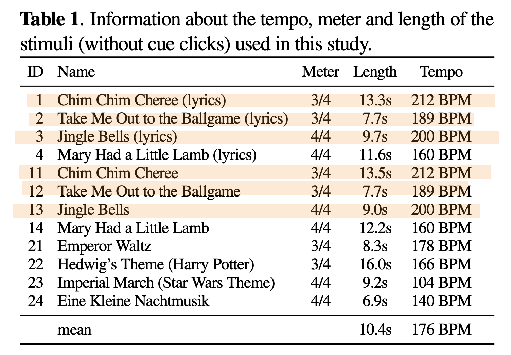

# BCI Final - Analyze EEG Taken During Music Perception and Imagination
111062610 陳奕君

## Overview
This project aims to investigate the OpenMIIR dataset in order to find useful information within EEG data and music stimulus and let more people know this field of research. 

The objectives are follow:
- Identify Brain Regions Involved in Music Perception and Imagination
- Fast / slow tempo classification based on EEG data
- Find the clue of song identification to identify which song the subject is listening to or imaging to meet the ultimate goal of MIIR, this is still a challenging task nowadays in academic area, but is crucial to disclose some information of it

## Usage
### Requirements
Install basic library.
```
pip3 install -r requirements.txt
```
Download openmiir information and asrpy
```
git clone https://github.com/sstober/openmiir.git
git clone https://github.com/DiGyt/asrpy.git
cd asrpy
pip3 install -e .
```
In asrpy.asrpy, change `np.int` to `np.int64`.

## Data Description
The OpenMIIR dataset comprises Electroencephalography (EEG) recordings taken during music perception and imagination. These data were collected from 10 subjects who listened to and imagined 12 short music fragments—each 7–16 s long—taken from well-known pieces. There are 3 groups with 4 stimuli each.

1. Stimuli 1–4 are from recordings of songs where a singing voice (lyrics) is present.
2. Stimuli 11–14 are from different recordings of the same songs as stimuli 1–4. These recordings do not contain a singing voice. Instead, the melody is played by one or more instruments.
3. Stimuli 21–24 are from recordings of purely instrumental pieces that do not have any lyrics and thus it is not possible to sing along.



All stimuli were normalized in volume and kept as similar in length as possible with care taken to ensure that they all contained complete musical phrases starting from the beginning of the piece. The pairs of recordings for the same song with and without lyrics were tempo-matched. The stimuli were presented to the participants in several conditions while EEG was recorded.

1. Stimulus perception with cue clicks
2. Stimulus imagination with cue clicks
3. Stimulus imagination without cue clicks
4. Stimulus imagination without cue clicks, with additional feedback from participants after each trial

The presentation was divided into 5 blocks that each comprised all 12 stimuli in randomized order. In total, 60 trials (12 stimuli × 5 blocks) per condition were recorded for each subject.

EEG was recorded from 10 participants (3 male), aged 19–36, with normal hearing and no history of brain injury. A BioSemi Active-Two system was used with 64 + 2 EEG channels sampled at 512Hz.

### Data Quality
 Outer pipes  Cell padding 
No sorting
| Pre-processing                  |                 |     | Average numbers of ICs classified by ICLabel |        |     |       |            |               |       |           |
| ------------------------------- | --------------- | --- | -------------------------------------------- | ------ | --- | ----- | ---------- | ------------- | ----- | --------- |
| EEG (P01 dataset - 64 channels) | bandpass-filter | ASR | Brain                                        | Muscle | Eye | Heart | Line Noise | Channel Noise | Other | Total ICs |
| raw                             |                 |     | 0                                            | 0      | 0   | 0     | 0          | 0             | 8     | 8         |
| filtered                        | ✅               |     | 15                                           | 0      | 2   | 0     | 1          | 3             | 16    | 37        |
| ASR-correlated                  | ✅               | ✅   | 17                                           | 0      | 2   | 0     | 0          | 3             | 28    | 50        |


## Model Framework

## Validation & Results

## Future Works


## Reference
Paper
- Stober, S., Sternin, A., Owen, A.M., & Grahn, J.A. (2015). Towards Music Imagery Information Retrieval: Introducing the OpenMIIR Dataset of EEG Recordings from Music Perception and Imagination. International Society for Music Information Retrieval Conference.
- Stober, S. (2017). Toward Studying Music Cognition with Information Retrieval Techniques: Lessons Learned from the OpenMIIR Initiative. Frontiers in Psychology, 8.
- Ntalampiras, S., & Potamitis, I. (2019). A Statistical Inference Framework for Understanding Music-Related Brain Activity. IEEE Journal of Selected Topics in Signal Processing, 13, 275-284.
- S. Ntalampiras, "Unsupervised Spectral Clustering of Music-Related Brain Activity," 2019 15th International Conference on Signal-Image Technology & Internet-Based Systems (SITIS), Sorrento, Italy, 2019, pp. 193-197, doi: 10.1109/SITIS.2019.00041.

Website
- OpenMIIR github: https://github.com/sstober/openmiir
- Deepthought github: https://github.com/sstober/deepthought
