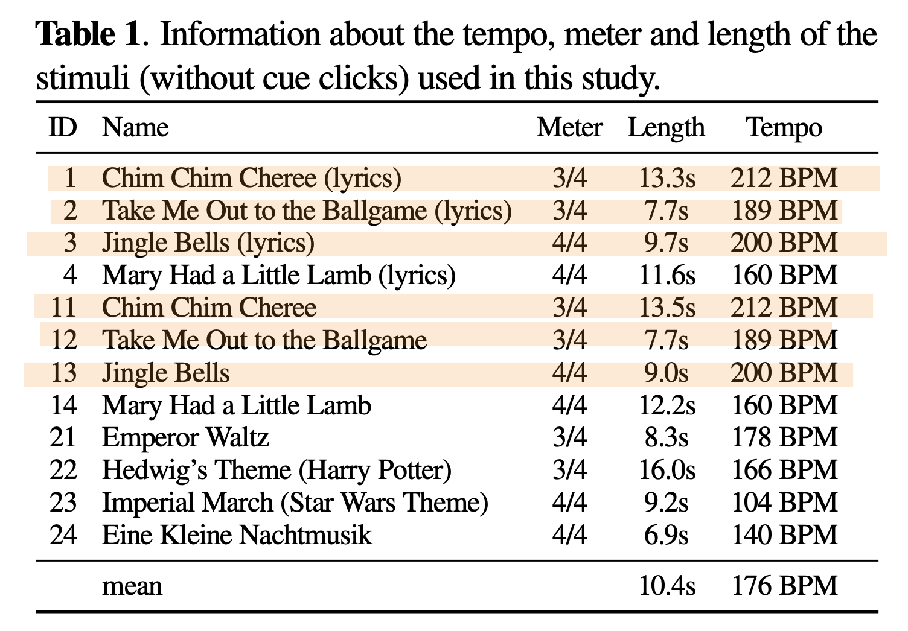
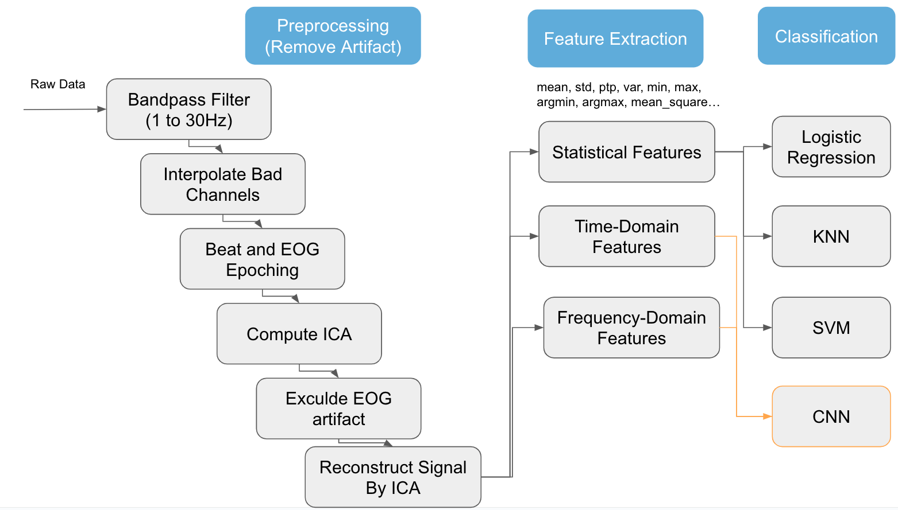

# BCI Final - Analyze EEG Taken During Music Perception and Imagination
111062610 陳奕君

## Overview
This project aims to investigate the OpenMIIR dataset in order to find useful information within EEG data and music stimulus and let more people know this field of research. 

The objectives are follow:
- Identify Brain Regions Involved in Music Perception and Imagination
- Fast / slow tempo classification based on EEG data
- Find the clue of song identification to identify which song the subject is listening to or imaging to meet the ultimate goal of MIIR, this is still a challenging task nowadays in academic area, but is crucial to disclose some information of it

## Usage
### Requirements
Install basic library.
```
pip3 install -r requirements.txt
```
Download openmiir information and asrpy
```
git clone https://github.com/sstober/openmiir.git
git clone https://github.com/DiGyt/asrpy.git
cd asrpy
pip3 install -e .
```
In asrpy.asrpy, change `np.int` to `np.int64`.

### Generate Artifact Removed Data
```
python3 remove_artifact.py
```

### Training
**Argument**
- cond: select condition from 1 to 5
- all: exclude P05 subject or not. Since P05 coughed while recording, so the data contain more noise.
- psd: use frequency-domain features or not, only work on cnn model.

**Method**
- logistic regression: `logistic_regression.py`
- k-nearest neighbor: `knn.py`
- support vector machine: `svm.py`
- convolutional neural network: `cnn.py`

```
python3 cnn.py --cond 1 --all --psd
```


## Data Description
The OpenMIIR dataset comprises Electroencephalography (EEG) recordings taken during music perception and imagination. These data were collected from 10 subjects who listened to and imagined 12 short music fragments—each 7–16 s long—taken from well-known pieces. There are 3 groups with 4 stimuli each.

1. Stimuli 1–4 are from recordings of songs where a singing voice (lyrics) is present.
2. Stimuli 11–14 are from different recordings of the same songs as stimuli 1–4. These recordings do not contain a singing voice. Instead, the melody is played by one or more instruments.
3. Stimuli 21–24 are from recordings of purely instrumental pieces that do not have any lyrics and thus it is not possible to sing along.



All stimuli were normalized in volume and kept as similar in length as possible with care taken to ensure that they all contained complete musical phrases starting from the beginning of the piece. The pairs of recordings for the same song with and without lyrics were tempo-matched. The stimuli were presented to the participants in several conditions while EEG was recorded.

1. Stimulus perception with cue clicks
2. Stimulus imagination with cue clicks
3. Stimulus imagination without cue clicks
4. Stimulus imagination without cue clicks, with additional feedback from participants after each trial

The presentation was divided into 5 blocks that each comprised all 12 stimuli in randomized order. In total, 60 trials (12 stimuli × 5 blocks) per condition were recorded for each subject.

EEG was recorded from 10 participants (3 male), aged 19–36, with normal hearing and no history of brain injury. A BioSemi Active-Two system was used with 64 + 2 EEG channels sampled at 512Hz.

### Data Quality
Due to time-consuming and high memory usage of ASR, here I only use 5 minutes of data, where tmin=10, tmax=310 (second).
There are total 10 subjects in this dataset, so I analyze the data quality of each subject. [Excel Table Link](https://docs.google.com/spreadsheets/d/1OFa4vArgFSqsREpNwL7D5V0bS7movyJwkqo6joUwPWw/edit?usp=sharing)

| EEG (P01 dataset - 64 channels) | bandpass-filter | ASR | Brain | Muscle | Eye | Heart | Line Noise | Channel Noise | Other | Total ICs |
| ------------------------------- | --------------- | --- | ----- | ------ | --- | ----- | ---------- | ------------- | ----- | --------- |
| raw                             |                 |     | 0     | 0      | 0   | 0     | 0          | 0             | 8     | 8         |
| filtered                        | ✅               |     | 15    | 0      | 2   | 0     | 1          | 3             | 16    | 37        |
| ASR-correlated                  | ✅               | ✅   | 17    | 0      | 2   | 0     | 0          | 3             | 28    | 50        |

| EEG (P04 dataset - 64 channels) | bandpass-filter | ASR | Brain | Muscle | Eye | Heart | Line Noise | Channel Noise | Other | Total ICs |
| ------------------------------- | --------------- | --- | ----- | ------ | --- | ----- | ---------- | ------------- | ----- | --------- |
| raw                             |                 |     | 0     | 0      | 0   | 0     | 0          | 0             | 6     | 6         |
| filtered                        | ✅               |     | 19    | 0      | 2   | 0     | 0          | 6             | 13    | 40        |
| ASR-correlated                  | ✅               | ✅   | 17    | 0      | 2   | 0     | 0          | 7             | 27    | 53        |

| EEG (P05 dataset - 64 channels) | bandpass-filter | ASR | Brain | Muscle | Eye | Heart | Line Noise | Channel Noise | Other | Total ICs |
| ------------------------------- | --------------- | --- | ----- | ------ | --- | ----- | ---------- | ------------- | ----- | --------- |
| raw                             |                 |     | 0     | 0      | 0   | 0     | 0          | 0             | 7     | 7         |
| filtered                        | ✅               |     | 5     | 0      | 4   | 0     | 0          | 21            | 16    | 46        |
| ASR-correlated                  | ✅               | ✅   | 26    | 3      | 1   | 0     | 0          | 13            | 13    | 56        |

| EEG (P06 dataset - 64 channels) | bandpass-filter | ASR | Brain | Muscle | Eye | Heart | Line Noise | Channel Noise | Other | Total ICs |
| ------------------------------- | --------------- | --- | ----- | ------ | --- | ----- | ---------- | ------------- | ----- | --------- |
| raw                             |                 |     | 0     | 0      | 0   | 0     | 0          | 0             | 5     | 5         |
| filtered                        | ✅               |     | 20    | 0      | 4   | 0     | 0          | 0             | 7     | 31        |
| ASR-correlated                  | ✅               | ✅   | 20    | 0      | 4   | 0     | 0          | 0             | 14    | 38        |

| EEG (P07 dataset - 64 channels) | bandpass-filter | ASR | Brain | Muscle | Eye | Heart | Line Noise | Channel Noise | Other | Total ICs |
| ------------------------------- | --------------- | --- | ----- | ------ | --- | ----- | ---------- | ------------- | ----- | --------- |
| raw                             |                 |     | 0     | 0      | 0   | 0     | 0          | 0             | 8     | 8         |
| filtered                        | ✅               |     | 13    | 2      | 2   | 0     | 0          | 0             | 10    | 27        |
| ASR-correlated                  | ✅               | ✅   | 20    | 2      | 2   | 0     | 0          | 0             | 19    | 43        |

| EEG (P09 dataset - 64 channels) | bandpass-filter | ASR | Brain | Muscle | Eye | Heart | Line Noise | Channel Noise | Other | Total ICs |
| ------------------------------- | --------------- | --- | ----- | ------ | --- | ----- | ---------- | ------------- | ----- | --------- |
| raw                             |                 |     | 0     | 0      | 0   | 0     | 0          | 0             | 3     | 3         |
| filtered                        | ✅               |     | 9     | 0      | 4   | 0     | 0          | 0             | 3     | 16        |
| ASR-correlated                  | ✅               | ✅   | 20    | 5      | 2   | 0     | 0          | 0             | 6     | 33        |

| EEG (P11 dataset - 64 channels) | bandpass-filter | ASR | Brain | Muscle | Eye | Heart | Line Noise | Channel Noise | Other | Total ICs |
| ------------------------------- | --------------- | --- | ----- | ------ | --- | ----- | ---------- | ------------- | ----- | --------- |
| raw                             |                 |     | 0     | 0      | 0   | 0     | 0          | 0             | 5     | 5         |
| filtered                        | ✅               |     | 16    | 2      | 1   | 0     | 0          | 1             | 6     | 26        |
| ASR-correlated                  | ✅               | ✅   | 20    | 2      | 1   | 0     | 0          | 1             | 8     | 32        |

| EEG (P12 dataset - 64 channels) | bandpass-filter | ASR | Brain | Muscle | Eye | Heart | Line Noise | Channel Noise | Other | Total ICs |
| ------------------------------- | --------------- | --- | ----- | ------ | --- | ----- | ---------- | ------------- | ----- | --------- |
| raw                             |                 |     | 0     | 0      | 0   | 0     | 0          | 0             | 5     | 5         |
| filtered                        | ✅               |     | 12    | 2      | 2   | 0     | 0          | 1             | 6     | 23        |
| ASR-correlated                  | ✅               | ✅   | 19    | 2      | 3   | 1     |            | 1             | 15    | 41        |

| EEG (P13 dataset - 64 channels) | bandpass-filter | ASR | Brain | Muscle | Eye | Heart | Line Noise | Channel Noise | Other | Total ICs |
| ------------------------------- | --------------- | --- | ----- | ------ | --- | ----- | ---------- | ------------- | ----- | --------- |
| raw                             |                 |     | 0     | 0      | 0   | 0     | 0          | 0             | 6     | 6         |
| filtered                        | ✅               |     | 21    | 0      | 2   | 0     | 0          | 3             | 3     | 29        |
| ASR-correlated                  | ✅               | ✅   | 21    | 0      | 2   | 0     | 0          | 5             | 8     | 36        |

| EEG (P14 dataset - 64 channels) | bandpass-filter | ASR | Brain | Muscle | Eye | Heart | Line Noise | Channel Noise | Other | Total ICs |
| ------------------------------- | --------------- | --- | ----- | ------ | --- | ----- | ---------- | ------------- | ----- | --------- |
| raw                             |                 |     | 0     | 0      | 0   | 0     | 0          | 0             | 5     | 5         |
| filtered                        | ✅               |     | 13    | 1      | 3   | 0     | 0          | 1             | 7     | 25        |
| ASR-correlated                  | ✅               | ✅   | 18    | 3      | 2   | 0     | 0          | 2             | 7     | 32        |


## Model Framework


## Validation & Results
### Table 1 -  Perception vs. Imagination

| Method | Feature generation | Dataset | Train acc | Valid acc | Test acc |
| --- | --- | --- | --- | --- | --- |
| LogisticRegression | Statistic | Include P05 | 0.727 | x | 0.538 |
|  | Statistic | Exclude P05 | 0.754 | x | 0.546 |
| SVM | Statistic | Include P05 | 0.714 | x | 0.542 |
|  | Statistic | Exclude P05 | 0.708 | x | 0.537 |
| KNN | Statistic | Include P05 | 0.709 | 0.546 | 0.5125 |
|  | Statistic | Exclude P05 | 0.713 | 0.545 | 0.546 |
| CNN | Time + Frequency | Include P05 | 0.5 | x | 0.5 |
|  | Time + Frequency | Exclude P05 | 0.5 | x | 0.5 |

### Table 2 - Fast tempo vs. Slow tempo

| Method | Feature generation | Dataset | Train acc | Valid acc | Test acc |
| --- | --- | --- | --- | --- | --- |
| LogisticRegression | Statistic | Include P05 | 0.6927 | x | 0.45 |
|  | Statistic | Exclude P05 | 0.7188 | x | 0.4120 |
| SVM | Statistic | Include P05 | 0.695 | x | 0.508 |
|  | Statistic | Exclude P05 | 0.715 | x | 0.444 |
| KNN | Statistic | Include P05 | 0.715 | 0.499 | 0.471 |
|  | Statistic | Exclude P05 | 0.743 | 0.495 | 0.509 |
| CNN | Time + Frequency | Include P05 | 0.5 | x | 0.5 |
|  | Time + Frequency | Exclude P05 | 0.5 | x | 0.5 |

### Table 3 - Song identification (12 category, all)

| Method | Feature generation | Dataset | Train acc | Valid acc | Test acc |
| --- | --- | --- | --- | --- | --- |
| LogisticRegression | Statistic | Include P05 | 0.562 | x | 0.121 |
|  | Statistic | Exclude P05 | 0.723 | x | 0.097 |
| SVM | Statistic | Include P05 | 0.392 | x | 0.092 |
|  | Statistic | Exclude P05 | 0.395 | x | 0.079 |
| KNN | Statistic | Include P05 | 0.354 | 0.069 | 0.067 |
|  | Statistic | Exclude P05 | 0.313 | 0.068 | 0.079 |
| CNN | Time + Frequency | Include P05 | 0.087 | x | 0.087 |
|  | Time + Frequency | Exclude P05 | 0.087 | x | 0.087 |

### Table 4 - Song identification (12 category, perception)

| Method | Feature generation | Dataset | Train acc | Valid acc | Test acc |
| --- | --- | --- | --- | --- | --- |
| LogisticRegression | Statistic | Include P05 | 0.973 | x | 0.142 |
|  | Statistic | Exclude P05 | 1.0 | x | 0.065 |
| SVM | Statistic | Include P05 | 0.433 | x | 0.075 |
|  | Statistic | Exclude P05 | 0.391 | x | 0.102 |
| KNN | Statistic | Include P05 | 0.360 | 0.103 | 0.108 |
|  | Statistic | Exclude P05 | 0.301 | 0.104 | 0.102 |
| CNN | Time + Frequency | Include P05 | 0.087 | x | 0.087 |
|  | Time + Frequency | Exclude P05 | 0.087 | x | 0.087 |

### Table 5 - Song identification (12 category, imagination)

| Method | Feature generation | Dataset | Train acc | Valid acc | Test acc |
| --- | --- | --- | --- | --- | --- |
| LogisticRegression | Statistic | Include P05 | 1.0 | x | 0.092 |
|  | Statistic | Exclude P05 | 0.991 | x | 0.074 |
| SVM | Statistic | Include P05 | 0.285 | x | 0.042 |
|  | Statistic | Exclude P05 | 0.259 | x | 0.065 |
| KNN | Statistic | Include P05 | 0.335 | 0.09 | 0.083 |
|  | Statistic | Exclude P05 | 0.343 | 0.083 | 0.083 |
| CNN | Time + Frequency | Include P05 | 0.087 | x | 0.087 |
|  | Time + Frequency | Exclude P05 | 0.087 | x | 0.087 |

## Future Works
The overall performance is not perfect may due to three reasons. 

First, the feature is poor. One can consider to use similarity-constraint encoding to generate faetures. A relative similarity constraint (a,b,c) describes a relative comparison of the trials a, b, and c in the form “a is more similar to b than a is to c.” We can use this constraint to train the encoder to generate strong and useful features to the model for specific tasks.

Second, the model architecture is poor. Besides CNN, other three methods are all basic machine learning method and do not contain many hyperparameter tuning. On the other hand, CNN needs a lot of heuristics to design a good model. One can try other combination of convolutional layer and pooling layer to get better results.

Last but not least, the dataset itself does not contain enough information to perform such stimulus classification tasks. Since every subject only listens to one stimulus in one condition for only 5 times, sum to 60 records in total. The number is far from the data amount one need to train powerful machine learning model nowadays. Wish more people participate in this kind of research and add more data, the situation may be reversed in the future.


## Reference
Paper
- Stober, S., Sternin, A., Owen, A.M., & Grahn, J.A. (2015). Towards Music Imagery Information Retrieval: Introducing the OpenMIIR Dataset of EEG Recordings from Music Perception and Imagination. International Society for Music Information Retrieval Conference.
- Stober, S. (2017). Toward Studying Music Cognition with Information Retrieval Techniques: Lessons Learned from the OpenMIIR Initiative. Frontiers in Psychology, 8.
- Ntalampiras, S., & Potamitis, I. (2019). A Statistical Inference Framework for Understanding Music-Related Brain Activity. IEEE Journal of Selected Topics in Signal Processing, 13, 275-284.
- S. Ntalampiras, "Unsupervised Spectral Clustering of Music-Related Brain Activity," 2019 15th International Conference on Signal-Image Technology & Internet-Based Systems (SITIS), Sorrento, Italy, 2019, pp. 193-197, doi: 10.1109/SITIS.2019.00041.

Website
- OpenMIIR github: https://github.com/sstober/openmiir
- Deepthought github: https://github.com/sstober/deepthought
